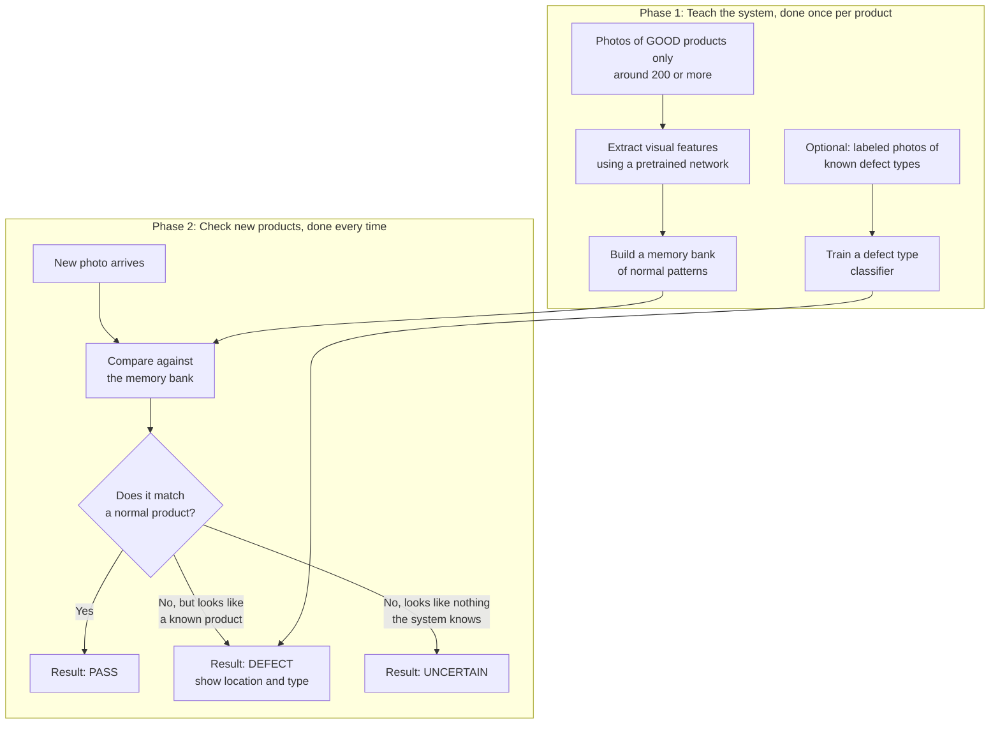
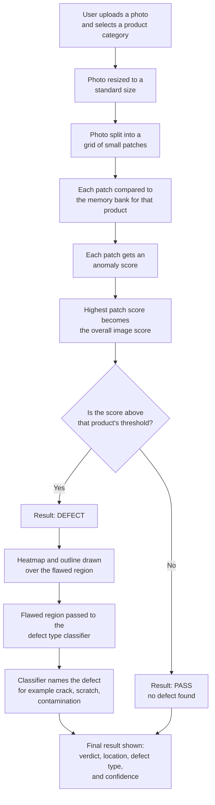

# Industrial Defect Detector

An AI system that checks photos of manufactured products and tells you whether a product is defective, where the defect is, and what kind of defect it is.

Built on PatchCore, an unsupervised anomaly detection method. It only needs photos of good, defect free products to learn what normal looks like. Anything that looks different from normal is flagged automatically, even defect types the system has never seen before.

## Live Demo

Try it here:  https://industrial-defect-detector.vercel.app/

Pick a product category, then click a sample photo to see a result. No upload required to test it.

## Demo Video

https://github.com/user-attachments/assets/7e5aa647-54e9-4acb-af3c-5b471ab9d053

## What It Does

- Detects whether a product is defective or not
- Shows exactly where the defect is on the photo, using a heatmap and an outline
- Names the type of defect, for example a crack, a scratch, or contamination
- Flags photos that do not match any known product as uncertain, instead of guessing
- Works across seven different product categories out of the box
- Can be taught a brand new product using only photos of good samples

## How It Works

1. The system is shown around 200 or more photos of good, undamaged products
2. It builds a memory of what a normal product looks like
3. A new photo is compared against that memory
4. If the photo matches normal, the result is pass
5. If it differs, the result is defect, with the location and type shown
6. If the photo looks nothing like any known product, the result is uncertain

## Methodology

Two phases: teaching the system what a good product looks like, then checking new products against that memory.

## Dataflow: Detecting a Specific Defect

Step by step view of what happens to a single photo, from upload to the final labeled result.

## Tech Stack

- PatchCore and anomalib for anomaly detection
- PyTorch for running the model
- scikit learn for defect type classification
- FastAPI and Gradio for serving the model
- React for the frontend
- Hugging Face Spaces and Vercel for hosting

## Project Background

This project extends research from my undergraduate thesis on video anomaly detection, applying the same core idea to industrial quality inspection.

## Notes

This project uses the MVTec AD dataset, licensed under CC BY NC SA 4.0, for training and demonstration. It is intended for portfolio and demonstration purposes.
